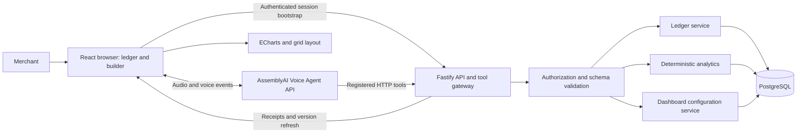

# System architecture

Use one TypeScript application stack with a separately deployable browser and API, and a PostgreSQL database. This limits language and deployment overhead while supporting a rich custom dashboard. The verified implementation currently includes the Fastify API v1 manual ledger adapter and PostgreSQL-backed domain services; the browser, voice gateway and deployment remain planned. See [[docs/04-Decisions]] for alternatives.

## Responsibilities

The React frontend owns microphone consent, visible transcript/proposals, widget selection, chart rendering, direct controls, layout drafts, and accessible alternatives. It sends authenticated requests and never holds the provider's long-lived secret. Apache ECharts renders typed chart data; React Grid Layout handles positioning. React can build both the front page and the dashboard—there is no need for a separate dashboard programming language.

AssemblyAI owns the speech conversation, turn handling, language-model interpretation and registered tool selection. The backend owns business rules and exposes narrow capabilities. HTTP tools are the preferred route for durable actions; their authentication and per-session binding must be proven in the spike. Client-side function tools can supply local selection state; any durable action still crosses the authenticated backend. The provider's `tool.call`/`tool.result` protocol is not assumed for HTTP tools. See [[docs/06-Agent-and-API]].

PostgreSQL is the durable truth for catalog, sales/revisions, confirmations, operation receipts, dashboards, and business ownership. Queries use parameterized SQL over allowed fields. The model cannot directly access the database or calculate authoritative totals.

## State and refresh

Voice and manual operations converge on the same service layer. After a commit, increment business ledger revision in the same transaction. Invalidate affected queries and refresh open widgets. MVP may use short polling while a voice action is outstanding; later add server events. Widget responses carry ledger revision, effective filters, completeness and server calculation time. Ignore late responses from older filters/revisions. A compound “record and show” commits first, then queries that revision or newer.

Selection context uses dashboard ID, widget ID and current version, checked against the authenticated owner. Persistent dashboard state is authoritative on the server; drag/resize is a local draft until saved. Optimistic version checks prevent an older voice command from overwriting a newer manual edit.

## Deployment shape

Deploy to Render using a three-tier architecture:
- Static Site for `apps/web` (React + Vite SPA) with single-page rewrite rules (`/* -> /index.html`).
- Web Service for `apps/api` (Node.js + Fastify) running the persistent container with outbound HTTPS, session management, and HTTP tool gateway.
- Managed PostgreSQL instance for persistent storage with automated daily backups.

The production region is Singapore (`singapore`) to minimize latency for Indonesian business timezones (`Asia/Jakarta`). No Redis, vector database, Python service, or multi-agent framework is required by the MVP. Operational boundaries are in [[docs/08-Security-and-Operations]]. See [[docs/04-Decisions]] (ADR-011).
