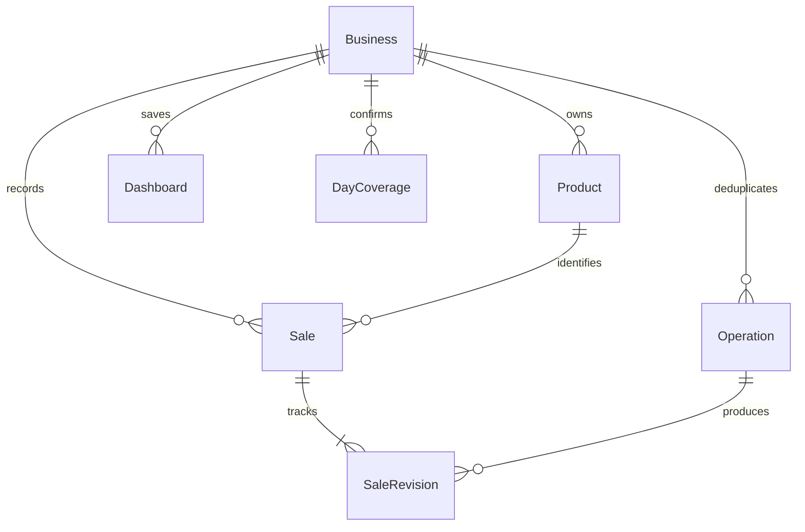

# Data model and calculation rules

The Day 20 portion of this logical schema is implemented in `db/migrations/001_initial_schema.sql`, with product optimistic versioning in `db/migrations/002_product_versions.sql`. The Day 21 mutation services and the Day 22 manual API are implemented and verified. Every business-owned relation carries `business_id`; ownership comes from authentication, never an LLM argument. See [[docs/08-Security-and-Operations]].

| Entity | Key fields and invariants |
| --- | --- |
| Business | UUID, owner_user_id, name, immutable currency=IDR or USD, timezone=Asia/Jakarta, ledger_revision |
| Product | UUID, business_id, name, aliases, active, optional default_unit_price; unique normalized name per business |
| Sale | UUID, business_id, product_id, quantity integer >0, unit_price nullable nonnegative integer minor units, sale_date local date, version, voided flag, created_at UTC |
| SaleRevision | UUID, sale_id, operation_id, before/after values, actor, reason, timestamp; append-only |
| DayCoverage | business_id + local date unique, state=open/complete, version; complete means user has confirmed all that day's records |
| CoverageRevision | UUID, business_id, local date, operation_id, before/after state, actor, timestamp; append-only |
| Proposal | UUID, business_id, session_id, normalized payload/hash, status, expiry, base versions; confirmation token bound to exact payload |
| Operation | UUID, business_id, idempotency_key, payload_hash, status, result receipt, actor; unique (business_id, idempotency_key) |
| Dashboard | UUID, business_id, name, schema_version, version, widget configurations and layouts as validated JSONB |
| VoiceSession | UUID, business_id, authenticated user, provider session reference, expiry, selected dashboard/widget; no permanent raw audio by default |

## Exact calculations

Money uses the selected business currency's exact minor unit: whole rupiah for IDR and cents for USD. Store amounts as BIGINT; serialize large values as decimal strings in JSON. User-facing USD decimal input is parsed to cents before calculation, while IDR rejects fractional rupiah. Quantity is a whole count. Revenue is quantity × unit price over active, known-price records. Unknown prices are null, never zero, and reduce reported revenue completeness. Product defaults are snapshotted at entry; a later catalog change must not rewrite historical revenue. A ledger never mixes currencies and EasyLedger performs no currency conversion.

Golden IDR arithmetic: 10 × 15,000 + 6 × 18,000 = 258,000. Correcting the first quantity to eight yields 228,000. USD 12.50 is stored as 1,250 cents. A zero price is a known free sale and differs from unknown price. Validate upper bounds and overflow before committing. Implemented limits: 100 lines per request, quantity at most 1,000,000 per line, price at most 1,000,000,000 minor units; reject rather than clamp.

## Implemented Day 20 foundation

The initial migration creates businesses, products, sales, sale revisions, day coverage and revisions, operations, proposals and dashboards. Composite foreign keys prevent cross-business references, audit revisions reject update/delete, and product normalization is unique within a business. The synthetic seed creates a labeled IDR juice-stall business with Orange Juice and Mango Juice. `packages/domain/money.ts` implements bounded bigint arithmetic, exact USD/IDR input parsing, unknown-versus-zero semantics and decimal-string serialization. PostgreSQL and domain verification results are recorded in [[docs/17-Verification-Record]].

## Time and completeness

Resolve “today” once using the business timezone and server time, then show the resolved date in confirmation. “This week” means Monday through Sunday local dates; show exact boundaries. Prior-week comparison aligns elapsed weekdays for a week-to-date request, or uses two full weeks only when explicitly requested. Label the chosen policy. Never silently compare a partial week with a full week.

No rows on an open day means unknown activity, displayed as a gap/null. Complete day with no sales is confirmed zero. Rows on an open day are partial recorded sales, not a promise that all sales are captured. Unknown-price rows make revenue incomplete even on a complete day. Percentage change with zero prior revenue is undefined and shown as “not available,” not infinity; missing periods suppress percentage claims. Units can still be queried when revenue is incomplete.

## Implemented mutation transaction

Authenticate; validate proposal and confirmation; claim unique operation key; check payload hash and base versions; write all sale/revision changes; increment ledger revision; persist receipt; commit atomically. A duplicate key with identical payload returns the stored result. Different payload with that key conflicts. A retry after timeout first reads operation status. Undo uses a new operation linked to the original and checks current versions; it never deletes history.

Day 21 implements this transaction for manual sale batches, corrections and compensating undos in `packages/domain/mutations.ts`. Day 22 adds idempotent, version-checked catalog create/update operations and audited coverage transitions through the same `operations` table; all successful catalog and coverage mutations increment `business.ledger_revision`. The Fastify adapter resolves the authenticated owner's business server-side and never accepts `business_id` or `actor_user_id` from HTTP input. Catalog IDs and sale IDs outside the tenant are returned as indistinguishable 404 responses.

Indexes: business/date and business/product/date for sales, unique operation key, dashboard business/ID and revision lookup. Charts and drilldown use the same normalized query and revision; if history has changed, refresh both rather than mixing snapshots. These rules implement [[docs/02-SRS]] and drive [[docs/06-Agent-and-API]].

Coverage changes use the same operation transaction and business revision as sales. A missing coverage row is logically open at version 0; completing it creates version 1, and reopening or completing an existing row advances its version. A no-sale complete receipt sets `confirmed_zero`; a complete day with sales remains complete but is not a zero day. Adding or correcting sales on a complete day reopens that day and displays a warning, since the prior completeness confirmation may no longer reflect all entries. A later explicit confirmation restores completeness. Product deactivation is a soft state change; historical product IDs remain resolvable while future sales through the inactive product are rejected.
